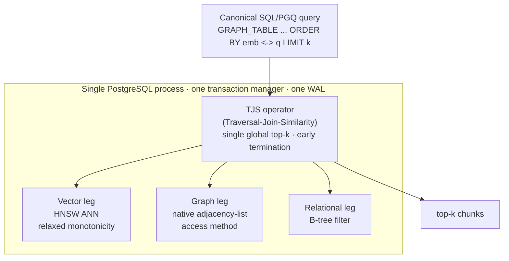

<!-- Banner / logo. TODO: add ./assets/banner-{light,dark}.svg and uncomment.
<p align="center">
  <picture>
    <source media="(prefers-color-scheme: dark)" srcset="./assets/banner-dark.svg">
    <source media="(prefers-color-scheme: light)" srcset="./assets/banner-light.svg">
    
  </picture>
</p>
-->

<h1 align="center">TriDB</h1>

<p align="center">
  <strong>One database engine that runs vector search, graph traversal, and relational filtering inside a single query plan — for Omni-RAG retrieval on local hardware.</strong>
</p>

<p align="center">
  <a href="#license"></a>
  <a href="https://github.com/ConsultingFuture4200/tridb/actions/workflows/ci.yml"></a>
  <a href="#benchmarks"></a>
  <a href="spec/tridb_spec_v0.1.0.md"></a>
</p>

<p align="center">
  
  
  
  
  
</p>

---

<details>
<summary>Table of Contents</summary>

- [About](#about)
- [Features](#features)
- [Architecture](#architecture)
- [Benchmarks](#benchmarks)
- [The Canonical Query](#the-canonical-query)
- [Quick Start](#quick-start)
- [Repository Layout](#repository-layout)
- [Status](#status)
- [License](#license)

</details>

## About

"Omni-RAG" retrieval needs three things at once: **similarity** (which chunks are relevant?), **traversal** (what's connected to them?), and **filtering** (which are in scope?). The usual answer stitches three systems together — a vector DB, a graph DB, and a relational DB — and merges results in application code. That **materialize-transfer-prune** cycle ships large intermediate sets across process boundaries on every turn.

TriDB collapses all three into **one query plan, in one PostgreSQL process, under one transaction manager**. The win isn't better individual retrievers — it's enforcing the global top-k *during* execution so intermediate results never blow up. It is a clean-room implementation of **AkasicDB** (SIGMOD Companion '26), built by forking **MSVBASE** (VBASE, OSDI '23) and adding a native graph store, extending **Chimera**'s (PVLDB 18(2)) dual-store design to a triple store.

## Features

- **Tri-modal in one plan** — vector + graph + relational compose in a single Volcano pipeline via the **TJS** (Traversal-Join-Similarity) operator, with a single global top-k.
- **Native graph store** — topology is a first-class adjacency-list **PostgreSQL access method** (32 KB pages, GenericXLog, crash/abort-durable), *not* relational join tables.
- **One transaction manager, one WAL** — the graph store lives inside the Postgres process, so a single transaction commits/rolls back atomically across all three stores (FR-7). No second WAL, no cross-system transactions.
- **Early termination everywhere (TR-1)** — every operator honors Open/Next/Close and stops as soon as the top-k is settled. No blocking operator is allowed to materialize a full intermediate result.
- **Standard query surface** — the one canonical query is plain SQL/PGQ `GRAPH_TABLE(...)` + pgvector `<->`, lowered to the `tjs()` operator. No new query language.
- **Cross-modal join ordering** — a selectivity heuristic chooses filter-first vs. vector-first to keep the intermediate working set small.

## Architecture



Contrast with the baseline TriDB is measured against — **out-of-DB integration** (AkasicDB Scenario 2): Milvus + Neo4j + Postgres as three separate systems, three transaction managers, results merged in Python. That separation is what forces the intermediate-result blowup and the cross-system round-trips.

## Benchmarks

Head-to-head against the multi-system baseline (Milvus + Neo4j + Postgres, app-side merge) on an **identical corpus and query set** (2000 entities, 12 queries, k=5). Both sides measured like-for-like (warm client wall-clock, median of runs). Run it yourself with `make sm2` and `make bench-live`.

| Metric | Meaning | Target | Result |
|--------|---------|--------|--------|
| **SM-1** | Intermediate-result reduction vs. baseline | ≥ 5× | **32×** |
| **SM-2** | Lower end-to-end latency than baseline | ≥ 80% of queries | **100% (12/12), ~13× faster** |
| **SM-3** | Corpus examined (k=5, worst case) | < 25% | **6.4%** |
| **SM-4** | Answer-set parity vs. exact oracle | ≥ 99% | **100%** |
| **SM-5** | Transaction atomicity across all stores | 100% | **100%** |

> [!NOTE]
> These are measured on an **x86_64 standin** at standin scale (~1–2 ms/query vs. the baseline's ~16–20 ms). The **128 GB headline benchmark** runs only on the GX10 target (ARM64 + CUDA) and is not yet run. Full methodology and caveats: [`docs/benchmark_sm2_v0.1.0.md`](docs/benchmark_sm2_v0.1.0.md) and [`docs/benchmark_results_v0.1.0.md`](docs/benchmark_results_v0.1.0.md).

## The Canonical Query

TriDB targets one locked query template for v1 — assembled from existing SQL/PGQ + pgvector standards, no new syntax:

```sql
SELECT chunk
FROM GRAPH_TABLE ( MATCH (src:entity)-[:related_to]->(dst:entity)
  COLUMNS ( src.embedding AS src_embedding,
            dst.chunk     AS chunk,
            dst.timestamp AS timestamp ) )
WHERE timestamp IN :selected_time_range
ORDER BY src_embedding <-> :question_embedding
LIMIT 5;
```

The `GRAPH_TABLE(...)` surface parses on stock PostgreSQL 13 and lowers to a single `tjs()` operator that drives all three legs with one global top-k.

## Quick Start

> [!IMPORTANT]
> The engine targets the **GX10 (ARM64 + CUDA, 128 GB)**. It builds and runs on an x86_64 standin via Docker for development; the ARM64 build sign-off and the 128 GB headline benchmark are GX10-only.

The repository has two layers. The hardware-independent layer (design, tooling, harnesses, Python tests) runs anywhere:

```bash
python3 -m venv .venv && . .venv/bin/activate
pip install -r requirements.txt
make test          # Python + lint layer — fast, no Docker
make lint
```

The engine layer needs the forked-MSVBASE image (`tridb/msvbase:dev`):

```bash
scripts/x86build.sh --docker   # build the fork image (x86_64 standin)
make test-all                  # test + lint + smoke + graph engine suites
make bench-live                # live SM-1/SM-3/SM-4/SM-5 on the real engine

make baseline-up               # stand up Milvus + Neo4j + Postgres baseline
make sm2                       # fair SM-2 latency head-to-head
make baseline-down
```

On the GX10 target:

```bash
scripts/gx10build.sh           # ARM64 + CUDA build of the MSVBASE fork
```

## Repository Layout

```text
spec/        Versioned spec mirror (source of truth: Linear doc TriDB)
docs/        Design specs, ADRs (docs/decisions/), benchmark results
scripts/     Build scripts (x86build.sh, gx10build.sh) + patch layer
src/         graph_store/ (native access method) + planner/ (join order)
tools/       Synthetic Omni-RAG corpus generators
baseline/    Milvus + Neo4j + Postgres multi-system baseline (DEV-1171)
bench/       TriDB benchmark harness + reports (DEV-1172/1173)
test/        Engine SQL suites (graph, tri-modal, canonical, FR-7)
tests/       Python unit tests (harness, planner, corpus)
```

## Status

Active development, tracked in Linear project **TriDB**. The tri-modal engine — native graph store, TJS operator, SQL/PGQ surface, HNSW vector durability, and cross-modal join ordering — is feature-complete. The **GX10 ARM64 build + engine suite are signed off** (the fork builds and the full suite passes on the DGX Spark; the first at-scale run found and fixed a TJS early-termination scale defect — SM-4 restored to 100%). Remaining on-target work: the **128 GB headline benchmark**, plus the honest SM-2 latency re-measurement at the corrected operating point (DEV-1284). See [`docs/STATUS.md`](docs/STATUS.md) for the per-issue breakdown.

## License

[MIT](LICENSE) — consistent with the upstream [`microsoft/MSVBASE`](https://github.com/microsoft/MSVBASE) base, whose derived portions remain under Microsoft's MIT copyright.
